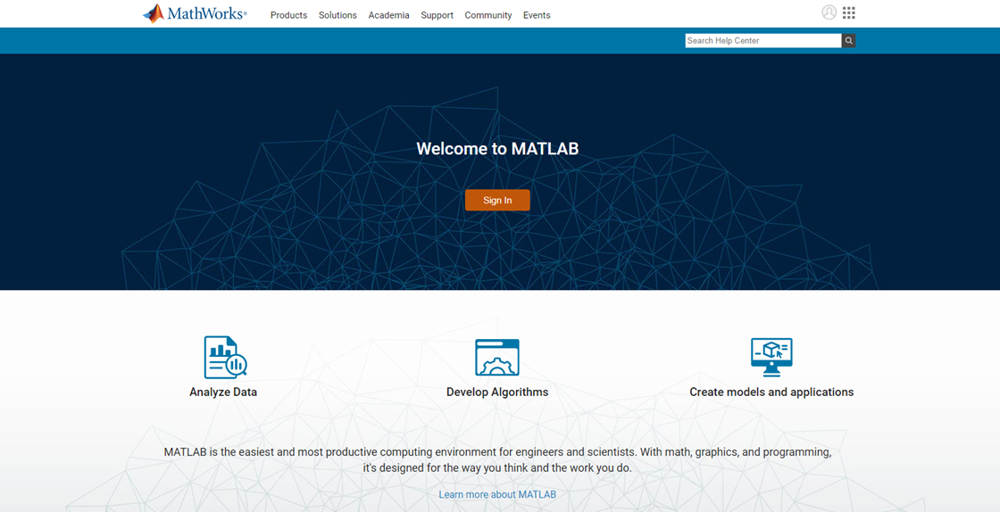
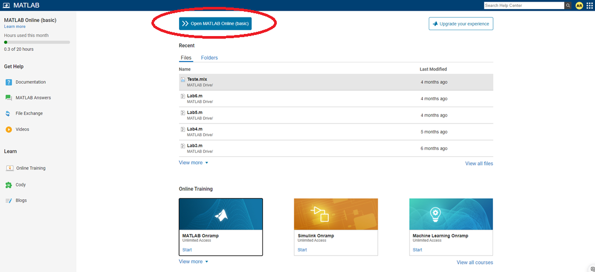
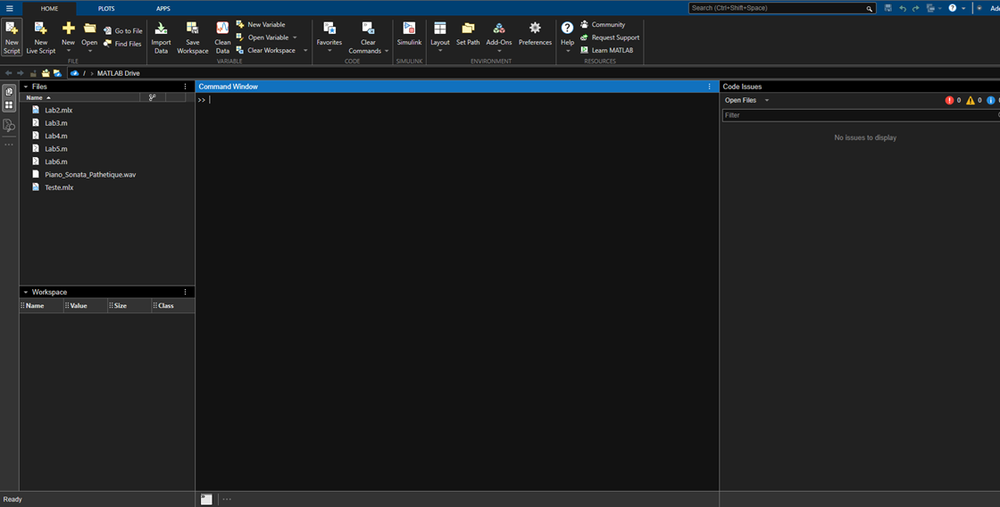

# _Informações para MATLAB Online_


---

## Sumário

- [Histórico de Versão](#histórico-de-versão)
- [Resumo](#resumo)
- [Objetivos](#objetivos)
- [Estrutura do Projeto](#estrutura-do-projeto)
- [Requisitos](#requisitos)
- [Informações Adicionais](#informações-adicionais)

## Histórico de Versão

| Versão | Data       | Autor        | Descrição            |
|--------|------------|--------------|----------------------|
| 1.0.0  | 01/03/2024 | Adenilton R  | Início do Projeto    |

---

## Resumo

Este projeto tem como objetivo principal explorar e aprender as funcionalidades do MATLAB, utilizando o MATLAB Online como plataforma. O MATLAB é uma ferramenta robusta e amplamente utilizada em diversas áreas da engenharia, ciências exatas e tecnologia, conhecida por sua capacidade de realizar cálculos complexos, análise de dados, visualização gráfica e simulação de sistemas.

## Objetivos

 - **`Exploração do MATLAB Online:`** Aprender a utilizar a versão online do
 MATLAB, entendendo suas vantagens e limitações, além de configurar o ambiente de trabalho.

 - **`Comandos Básicos:`** Estudo e aplicação dos comandos fundamentais do MATLAB, abordando operações matemáticas, manipulação de matrizes, e uso de funções.

 - **`Criação de Gráficos:`** Desenvolver e personalizar gráficos 2D e 3D, explorando as capacidades de visualização de dados do MATLAB.

 - **`Documentação de Exemplos:`** Fornecer exemplos práticos que servem como guia para iniciantes, incluindo scripts comentados e explicações passo a passo.

 - **`Desenvolvimento de Projetos Simples:`** Implementação de pequenos projetos que aplicam os conceitos aprendidos, servindo como estudo de caso para aplicações mais complexas.

## Estrutura do Projeto

 - **`Documentação:`** Tutoriais e guias passo a passo para começar no MATLAB, com explicações detalhadas e exemplos.

 - **`Exemplos de Código:`** Scripts exemplares mostrando desde operações básicas até a criação de gráficos e simulações simples.

 - **`Projetos Práticos:`** Pequenos projetos aplicados que demonstram o uso do MATLAB em problemas reais.

## Requisitos

Para seguir este projeto, são necessários os seguintes passos:

- **`Criar uma Conta no MATLAB:`** Acesse o site [**`MathWorks`**](https://matlab.mathworks.com/) e crie uma conta gratuita ou faça login se já tiver uma. A conta é essencial para acessar o MATLAB Online e armazenar seus arquivos na nuvem.
    
    
    
- Depois de logado clique em `Open MATLAB Online (basic)`.
    
    
    
- Clique em `New Script` para criar o primeiro projeto.
    
    
    
- Exemplo do cabeçalho.
    
    ```matlab
    %NOME:Nome
    %DATA:23/09/2024
    %PROJETO: Nome do projeto
    %VERSAO: 01
    %DESCRiCAO: - feat: Descrição
    %LINKS:
    ```
    
- **`Acessar o MATLAB Online:`** Após criar a conta, acesse o MATLAB Online através do navegador. O MATLAB Online oferece uma interface completa para realizar cálculos, criar gráficos e desenvolver scripts diretamente na web, sem necessidade de instalação local.

## Informações Adicionais


